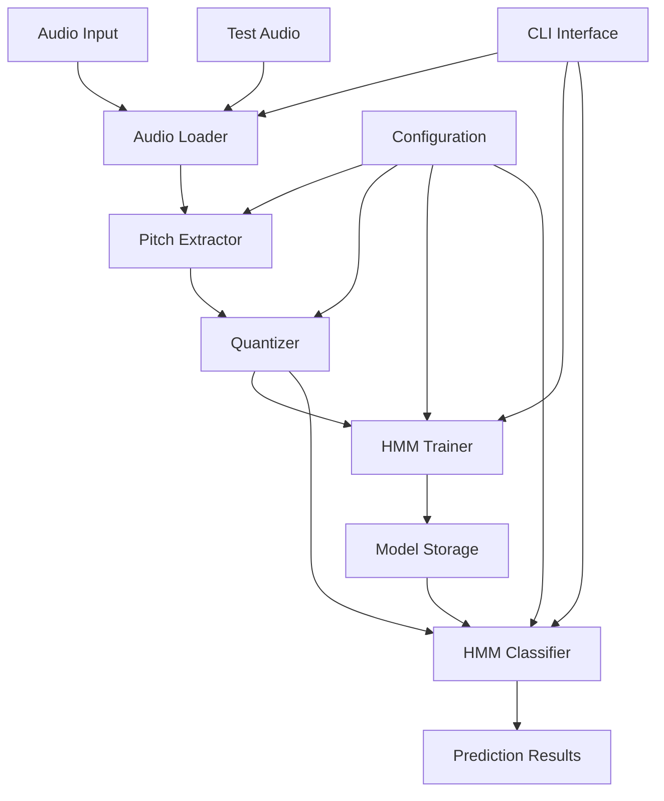

# Design Document

## Overview

The RaagHMM system implements a machine learning pipeline for automatic raag (raga) detection in Indian classical music using Hidden Markov Models with discrete emissions. The system processes audio recordings through pitch extraction, chromatic quantization, tonic normalization, and HMM-based classification to identify one of five raag classes: Bihag, Darbari, Desh, Gaud_Malhar, and Yaman.

The architecture follows a modular design with clear separation between data processing, feature extraction, model training, and inference components. The system is designed to be extensible, allowing for additional raag classes and alternative feature extraction methods.

## Architecture



### Core Components

1. **Audio Processing Pipeline**: Handles loading, resampling, and format conversion
2. **Pitch Extraction Engine**: Multi-method pitch detection with fallback mechanisms
3. **Feature Quantization Module**: Chromatic binning and tonic normalization
4. **HMM Training System**: Discrete HMM implementation with Baum-Welch algorithm
5. **Classification Engine**: Forward algorithm scoring and prediction
6. **CLI Interface**: Command-line tools for all operations
7. **Evaluation Framework**: Comprehensive metrics and analysis tools

## Components and Interfaces

### 1. Audio I/O Module (`raag_hmm.io`)

**Purpose**: Handle audio file loading, metadata parsing, and dataset iteration.

**Key Classes**:
- `AudioLoader`: Manages audio file loading with format detection and resampling
- `MetadataParser`: Validates and parses JSON metadata files
- `DatasetIterator`: Provides structured access to train/test splits

**Interfaces**:
```python
def load_audio(path: str, sr: int = 22050) -> np.ndarray
def load_metadata(path: str) -> dict
def iter_dataset(root: str, split: str) -> Iterator[Tuple[str, dict]]
```

**Error Handling**: 
- Unsupported audio formats raise `AudioFormatError`
- Missing metadata raises `MetadataValidationError`
- Invalid sample rates trigger automatic resampling with warnings

### 2. Pitch Extraction Module (`raag_hmm.pitch`)

**Purpose**: Extract fundamental frequency contours using multiple algorithms with robust fallback.

**Key Classes**:
- `PraatExtractor`: Primary pitch extraction using parselmouth
- `LibrosaExtractor`: Fallback using pyin/yin algorithms
- `PitchSmoother`: Post-processing for octave error correction and gap filling

**Interfaces**:
```python
def extract_pitch_praat(y: np.ndarray, sr: int, frame_sec: float, hop_sec: float) -> Tuple[np.ndarray, np.ndarray]
def extract_pitch_librosa(y: np.ndarray, sr: int, method: str = 'pyin') -> Tuple[np.ndarray, np.ndarray]
def smooth_pitch(f0_hz: np.ndarray, voicing_prob: np.ndarray = None) -> np.ndarray
```

**Algorithm Details**:
- Frame size: 0.0464 seconds (1024 samples at 22050 Hz)
- Hop size: 0.01 seconds (220 samples at 22050 Hz)
- Voicing threshold: 0.5 for probability-based filtering
- Smoothing: Median filter (window=5) followed by Gaussian (sigma=1.0)
- Gap filling: Linear interpolation for segments < 100ms

### 3. Quantization Module (`raag_hmm.quantize`)

**Purpose**: Convert pitch frequencies to discrete chromatic bins normalized by tonic.

**Key Classes**:
- `ChromaticQuantizer`: Maps frequencies to 36-bin chromatic scale
- `TonicNormalizer`: Shifts pitch relative to tonic frequency

**Interfaces**:
```python
def hz_to_midi(f_hz: float) -> float
def nearest_chromatic_bin(midi: float, base_midi: float = 48) -> int  # C3 = 48
def normalize_by_tonic(f0_hz: np.ndarray, tonic_hz: float) -> np.ndarray
def quantize_sequence(f0_hz: np.ndarray, tonic_hz: float) -> np.ndarray
```

**Quantization Mapping**:
- Range: C3 (130.81 Hz) to B5 (987.77 Hz) = 36 semitones
- Formula: `midi = 12 * log2(f_hz / 440.0) + 69`
- Normalization: `f_normalized = f_hz * (261.63 / tonic_hz)` (shift tonic to C4)
- Output: Integer array [0, 35] representing chromatic bins

### 4. HMM Module (`raag_hmm.hmm`)

**Purpose**: Implement discrete HMM with Baum-Welch training and forward algorithm inference.

**Key Classes**:
- `DiscreteHMM`: Core HMM implementation with scaling
- `BaumWelchTrainer`: EM algorithm with convergence monitoring
- `ForwardScorer`: Log-likelihood computation for classification

**Model Architecture**:
- States (N): 36 hidden states
- Observations (M): 36 discrete symbols (chromatic bins)
- Topology: Fully connected (ergodic) structure
- Initialization: Uniform π, random stochastic A and B matrices

**Training Algorithm**:
```python
# Baum-Welch with scaling
for iteration in range(max_iters):
    # E-step: Forward-backward with scaling
    alpha, beta, c_scale, log_likelihood = forward_backward_scaled(pi, A, B, observations)
    
    # M-step: Parameter updates
    pi_new, A_new, B_new = update_parameters(alpha, beta, c_scale, observations)
    
    # Convergence check
    if abs(log_likelihood - prev_log_likelihood) < tolerance:
        break
```

**Numerical Stability**:
- Scaling coefficients prevent underflow: `c_t = 1 / sum(alpha_t)`
- Log-likelihood: `log P(O|λ) = -sum(log(c_t))`
- Regularization: Dirichlet smoothing (α=0.01) and probability floors (1e-8)

### 5. Training Module (`raag_hmm.train`)

**Purpose**: Orchestrate end-to-end model training for all raag classes.

**Key Classes**:
- `RaagTrainer`: Manages multi-class training pipeline
- `ModelPersistence`: Handles model serialization and metadata

**Training Pipeline**:
1. Load training dataset with metadata validation
2. Extract and quantize pitch sequences for each recording
3. Group sequences by raag class
4. Train separate HMM for each raag using Baum-Welch
5. Validate convergence and save models with metadata

**Model Storage Format**:
```
models/
├── bihag.pkl          # Serialized HMM model
├── bihag_meta.json    # Training metadata
├── darbari.pkl
├── darbari_meta.json
└── ...
```

### 6. Inference Module (`raag_hmm.infer`)

**Purpose**: Load trained models and classify unknown audio recordings.

**Key Classes**:
- `RaagClassifier`: Multi-model inference engine
- `ModelLoader`: Handles model deserialization and validation

**Classification Algorithm**:
```python
def predict_raag(models: Dict[str, HMM], sequence: np.ndarray) -> Tuple[str, Dict[str, float]]:
    scores = {}
    for raag_name, model in models.items():
        log_likelihood = model.score(sequence)  # Forward algorithm
        scores[raag_name] = log_likelihood
    
    predicted_raag = max(scores, key=scores.get)
    return predicted_raag, scores
```

### 7. Evaluation Module (`raag_hmm.evaluate`)

**Purpose**: Comprehensive performance analysis and metrics computation.

**Key Metrics**:
- Overall accuracy: `correct_predictions / total_predictions`
- Per-class accuracy: Individual raag classification rates
- Top-k accuracy: Percentage where true class is in top-k predictions
- Confusion matrix: Detailed classification breakdown

**Analysis Features**:
- Statistical significance testing
- Per-recording confidence analysis
- Error pattern identification
- Performance by audio characteristics (duration, quality, etc.)

## Data Models

### Audio Metadata Schema
```python
@dataclass
class AudioMetadata:
    recording_id: str
    raag: str
    tonic_hz: float
    artist: Optional[str] = None
    instrument: Optional[str] = None
    split: Literal['train', 'test', 'val'] = 'train'
    notes: Optional[str] = None
```

### HMM Model Schema
```python
@dataclass
class HMMModel:
    pi: np.ndarray          # Initial state probabilities [N]
    A: np.ndarray           # Transition matrix [N, N]
    B: np.ndarray           # Emission matrix [M, N]
    n_states: int = 36
    n_observations: int = 36
    
@dataclass
class TrainingMetadata:
    raag_name: str
    n_sequences: int
    total_frames: int
    convergence_iterations: int
    final_log_likelihood: float
    training_time: float
    hyperparameters: dict
```

### Feature Representation
```python
@dataclass
class PitchFeatures:
    times: np.ndarray       # Time stamps [T]
    f0_hz: np.ndarray      # Raw pitch frequencies [T]
    voicing: np.ndarray    # Voicing probabilities [T]
    quantized: np.ndarray  # Chromatic bin indices [T]
    tonic_hz: float        # Reference tonic frequency
```

## Error Handling

### Exception Hierarchy
```python
class RaagHMMError(Exception):
    """Base exception for RaagHMM system"""

class AudioProcessingError(RaagHMMError):
    """Audio loading or processing failures"""

class PitchExtractionError(RaagHMMError):
    """Pitch detection algorithm failures"""

class QuantizationError(RaagHMMError):
    """Feature quantization issues"""

class ModelTrainingError(RaagHMMError):
    """HMM training convergence or numerical issues"""

class ClassificationError(RaagHMMError):
    """Inference and prediction failures"""
```

### Error Recovery Strategies
- **Pitch extraction failures**: Automatic fallback from Praat to librosa methods
- **Numerical instability**: Scaling and regularization in HMM algorithms
- **Missing metadata**: Graceful degradation with default tonic estimation
- **Model loading errors**: Clear error messages with troubleshooting guidance

## Testing Strategy

### Unit Tests
- **Quantization accuracy**: Verify chromatic bin mapping and tonic normalization
- **HMM numerical stability**: Test forward-backward scaling with extreme values
- **Audio processing**: Validate format conversion and resampling
- **Configuration validation**: Test parameter bounds and type checking

### Integration Tests
- **End-to-end pipeline**: Train models on synthetic data and verify predictions
- **Cross-platform compatibility**: Test on different operating systems
- **Performance benchmarks**: Measure processing speed and memory usage
- **Reproducibility**: Verify deterministic results with fixed random seeds

### Test Data Strategy
- **Synthetic sequences**: Generate known patterns for algorithm validation
- **Minimal real dataset**: Small subset of actual recordings for integration testing
- **Edge cases**: Test with extreme pitch ranges, noise, and silence
- **Format compatibility**: Test with various audio formats and sample rates

### Performance Requirements
- **Training time**: < 5 minutes for 5 raag classes with 15 sequences each
- **Inference speed**: < 1 second per minute of audio
- **Memory usage**: < 1GB RAM for typical datasets
- **Accuracy target**: > 75% on held-out test set (matching paper baseline)

## Configuration Management

### Default Configuration
```python
DEFAULT_CONFIG = {
    'audio': {
        'sample_rate': 22050,
        'channels': 1,
        'supported_formats': ['wav', 'flac', 'mp3']
    },
    'pitch': {
        'frame_sec': 0.0464,
        'hop_sec': 0.01,
        'voicing_threshold': 0.5,
        'smoothing_window': 5
    },
    'quantization': {
        'n_bins': 36,
        'base_midi': 48,  # C3
        'reference_tonic': 261.63  # C4
    },
    'hmm': {
        'n_states': 36,
        'n_observations': 36,
        'max_iterations': 200,
        'convergence_tolerance': 0.1,
        'regularization_alpha': 0.01,
        'probability_floor': 1e-8
    }
}
```

### Environment-Specific Overrides
- Development: Reduced iterations for faster testing
- Production: Enhanced numerical stability settings
- Research: Configurable model architectures and hyperparameters